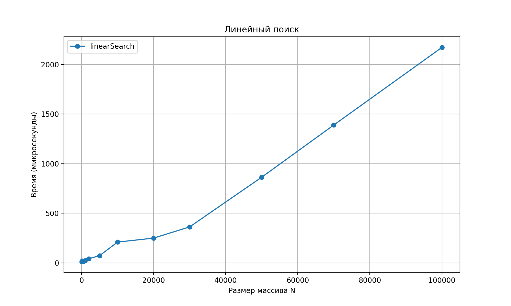
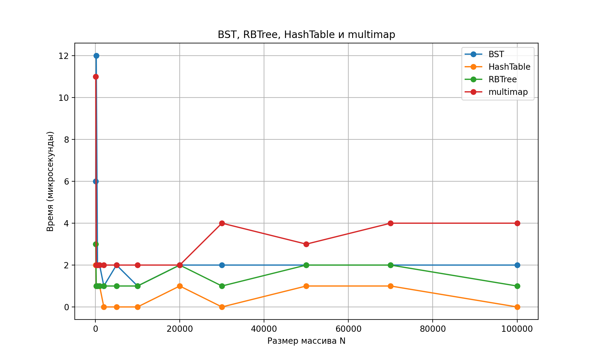
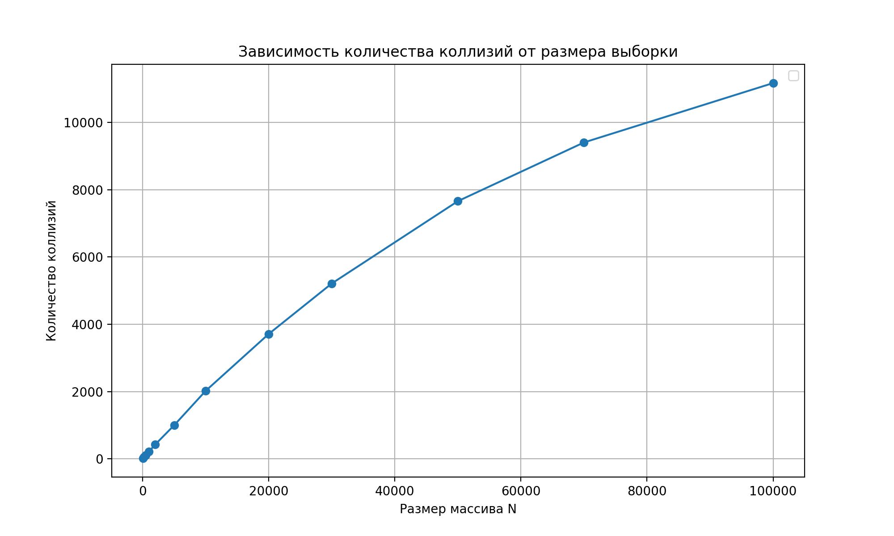

# Лабораторная работа №2: алгоритмы поиска данных

## Документация Doxygen

[Открыть документацию](docs/html/index.html)

## Исходный код 

[GitHub](https://github.com/Cloudinio/ProgramMethods/tree/main/lab_2)

## Графики

